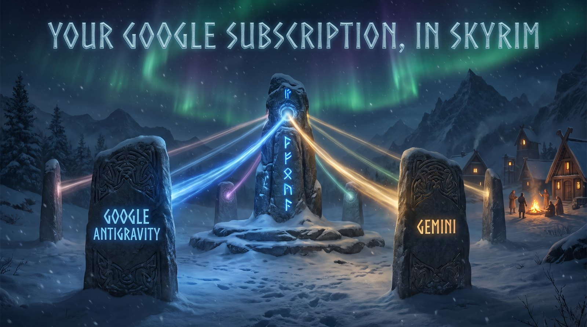
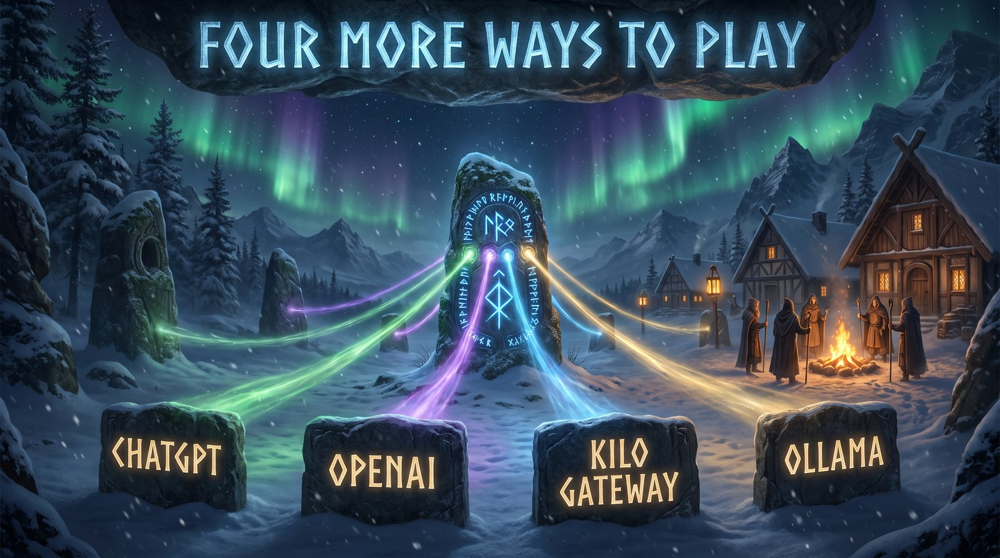

# v2.5.0 — Codex goes beyond ChatGPT

## ✨ What's New

**Codex isn't locked to just your ChatGPT subscription anymore.**

Until now, putting `codex/MODEL` in SkyrimNet only ever routed through your personal ChatGPT login. That was great for plug-and-play access, but limited if you wanted Codex's speed with other models. Starting in v2.5.0, your Codex setup can act as a launchpad for other AI services too—letting you jump between local models, official developer keys, and multi-model hubs without giving up Codex's workflow.

* **Codex can now talk to other AI providers.** The Codex card in the dashboard lets you add and manage extra services. We've built in quick presets for OpenAI's official API, a local Ollama install, and a local LM Studio setup, plus room for any custom OpenAI-compatible endpoint (like OpenRouter or a self-hosted gateway). Give each one a nickname, then route to it in SkyrimNet using `codex/<provider-id>/MODEL` (for example, `codex/sn-my-openrouter/anthropic/claude-sonnet-4.5`).
* **Your default ChatGPT setup stays right where it is.** A plain `codex/MODEL` with no provider ID still goes straight to your personal subscription, exactly as it always has. The proxy keeps its own list of extra providers and never touches your real Codex CLI login or files. Just note: custom endpoints need to support the newer "Responses API" format that Codex's CLI expects, rather than the older "Chat Completions" style (most modern services, including OpenRouter, handle this out of the box).
* **DeepSeek joins the lineup.** DeepSeek now has its own first-class card in the dashboard. Drop in your API key, then use `deepseek/MODEL` (like `deepseek/deepseek-flash`) to route directly through their official, pay-as-you-go service.

## 📋 Good to Know

* **Upgrading from v2.4.1:** Just replace `proxy.py` with the new version. Your `config.json` carries over completely untouched, keeping your saved keys and existing Codex login intact.
* **Nothing to redo in SkyrimNet:** Your endpoint, blank API key, and current model names stay exactly as they are. You only need to touch SkyrimNet's settings if you want to try out a new DeepSeek model or a Codex provider route.

## 💬 Need Help?

Ran into a glitch or have a suggestion? Feel free to [open an issue on GitHub](https://github.com/awesmdiver/skyrimnet-multiproxy/issues)!

# v2.4.1 — Long conversations, fixed

## ✨ What's New

**A fix for anyone using Google Antigravity with SkyrimNet.**

Antigravity worked fine in testing and then failed for real players, because SkyrimNet's prompts are far bigger than a test prompt. Once a conversation carried enough context — a character's biography, their memories of you, recent events — the reply stopped mid-sentence, SkyrimNet threw a transfer error, and the NPC went quiet. That is fixed, and confirmed working in game by the player who reported it.

* **Google Antigravity handles full-size conversations now.** The prompt is handed over a different way, one with no length limit, so a long memory or a detailed character sheet won't cut the reply off. Tested up to 150,000 characters — far more than SkyrimNet ever sends.
* **A failed reply explains itself instead of vanishing.** Previously, an unexpected error partway through a response could leave you with a half-finished sentence and no reason why. Every provider now ends the reply with a readable error message — Claude, ChatGPT, Antigravity, Gemini, OpenRouter, GLM, Nano-GPT, OpenAI, Kilo Gateway, and Ollama.
* **ChatGPT offers every model your account can run.** The dashboard used to list a single hard-coded model. It now fetches the actual list from your Codex login, with a **Refresh** button for when OpenAI updates the lineup.
* **The plugin reports its real version.** `SkyrimNetMultiProxy.dll` had been telling SKSE it was version 2.0.0.0 since the first release, making crash logs misleading. It now reports the real version you installed.

## 📋 Good to Know

* **Upgrading from v2.4.0:** Two files to swap. Replace `proxy.py` with the new one — that's every fix above. Then install the new `SkyrimNetMultiProxy.zip` in Vortex or MO2 over the old plugin mod, so `SkyrimNetMultiProxy.dll` gets replaced too; that one only affects the version your crash logs report, so skip it if you'd rather. Your `config.json` carries over untouched either way.
* **Nothing to redo in SkyrimNet:** Your endpoint, blank API key, and model names stay exactly as they are.
* **Already using a ChatGPT model?** It will keep working. The new list adds the rest of your available models without replacing the one you're currently using.

## 💬 Need Help?

Ran into a glitch or have a suggestion? Feel free to [open an issue on GitHub](https://github.com/awesmdiver/skyrimnet-multiproxy/issues)!

# v2.4.0 — Your Google Subscription, in Skyrim

## ✨ What's New

**Already paying for Google AI Pro? Now Skyrim can use it.**

Google AI Pro and Ultra subscriptions now work the same way your Claude and ChatGPT subscriptions already do: signed in, with no API key to manage. That brings SkyrimNet MultiProxy to ten supported providers, including three subscription routes you might already be paying for.

* **Google AI Pro/Ultra support (no key needed):** Install [Google's Antigravity CLI](https://antigravity.google), sign in once with your Google account, and use the `geminicli/MODEL` prefix. You do not need to paste any API key into the dashboard.
* **Access non-Gemini models through your Google account:** Your Google subscription is not limited to Gemini. The dashboard automatically lists whichever models your signed-in account can run (including Claude and GPT-OSS models alongside Google's own), with a **Refresh** button for when Google updates the lineup.
* **Gemini API key support:** Add a Google AI Studio key and use `gemini/MODEL` to go straight to Google's Gemini API — nothing to install, no CLI in the picture. The dashboard lists all models available for your key so you don't have to guess exact model names.
* **Real streaming on the subscription route:** NPC dialogue streams in chunk by chunk as it generates, matching how SkyrimNet expects to display text, rather than waiting for the entire response to finish before sending.

## 📋 Good to Know

* **Which of the two to pick:** It comes down to what you already have. The Gemini API key route needs nothing installed and answers faster, since it calls Google's API directly. The Antigravity route needs the Antigravity CLI installed and signed in, and each reply is a real CLI call, so it takes a little longer to start — the one to use if you already have Antigravity, or you'd rather not manage an API key at all.
* **Plugin updates not required:** This update only modifies the proxy script. If you already have the SKSE plugin installed from the previous release, it will work as-is. Just replace your `proxy.py` with the new file.
* **Your configuration carries over:** You can safely keep or copy over your existing `config.json` file; the configuration format has not changed.

## 💬 Need Help?

Ran into a glitch or have a suggestion? Feel free to [open an issue on GitHub](https://github.com/awesmdiver/skyrimnet-multiproxy/issues)!

# v2.3.0 — SkyrimNet MultiProxy: Your AI, Your Choice

## ✨ What's New

**A new name, because it's not just Claude anymore!**

Claude SkyrimNet Proxy Launcher is now **SkyrimNet MultiProxy**. Everything SkyrimNet uses AI for — NPC conversations and actions, diaries, bios, the GameMaster, and more — can now run on eight different AI providers, and you don't need a Claude subscription to use any of them.

* **Use the subscription you already have:** Claude still works through your Claude CLI login, and ChatGPT is now supported through OpenAI's Codex CLI. No API keys required for either.
* **More providers:** OpenAI, Kilo Gateway, and Ollama join OpenRouter, GLM (z.ai), and Nano-GPT.
* **Free local models with Ollama:** Run AI models locally on your own PC. The dashboard lists the models you have installed, with a **Refresh** button when you pull a new one. If you add an Ollama Cloud key, the dashboard lists Ollama's hosted models instead.
* **No Claude required:** The proxy starts and runs without Claude installed. Claude is only needed if you choose a Claude model.

**A Cleaner Dashboard**

No more endless scrolling through key cards and model tables. Open `http://127.0.0.1:8000` to pick a provider from a single dropdown, view its status, paste your key, and copy model names with one click. The Quick Test feature only enables providers ready to respond, and explains any failures in plain English.

## 🔧 Improvements & Polish

* **Clean zip structure:** The release archive now unzips into a single `SkyrimNet MultiProxy` folder instead of scattering loose files.
* **Safer logging:** The proxy no longer prints your Claude session token to the log file.
* **Clearer error handling:** If an AI provider rejects a prompt, SkyrimNet receives a clean, readable error instead of garbled text.

## 📋 Good to Know

* **Plugin renamed:** `ProxyLauncher.dll` is now `SkyrimNetMultiProxy.dll`. Remove the old ProxyLauncher mod from your mod manager before installing the new version.
* **Upgrading your settings:** When it first runs, the new plugin automatically copies your old `ProxyLauncher.ini` values into `SkyrimNetMultiProxy.ini`. Update `ProxyScript` and `WorkDir` so they point to your new `SkyrimNet MultiProxy` folder. Copy your existing `config.json` into the new folder to bring over your saved API keys.
* **ChatGPT response time:** Because ChatGPT runs through the Codex CLI, replies will take longer to generate than with direct API providers.
* **Using Claude?** The Terms of Service notice in the README still applies if you use Claude subscription models.

## 🤝 Special Thanks

A huge thank you to **[rhinos0608](https://github.com/rhinos0608/skyrimnet-codex-proxy)**! Their skyrimnet-codex-proxy project provided the core idea and code for our OpenAI, Kilo Gateway, Ollama, and ChatGPT/Codex integration.

## 💬 Need Help?

Ran into a glitch or have a suggestion? Feel free to [open an issue on GitHub](https://github.com/awesmdiver/skyrimnet-multiproxy/issues)!
